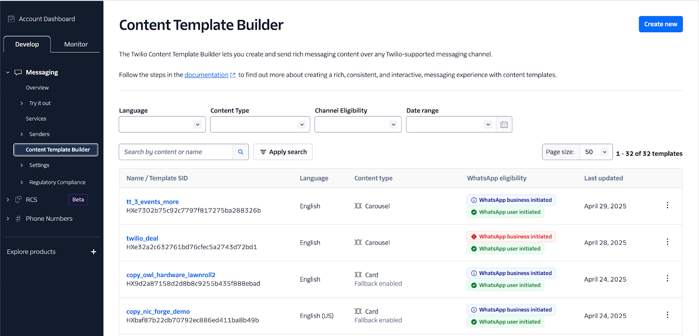

# 🚀 RCS Unlocked: Send Rich Messages in 60 Minutes

Welcome to this 60-minute hands-on lab for intermediate Twilio users at [SIGNAL 2025](https://signal.twilio.com/2025)!

## 📖 Workshop Overview

RCS (Rich Communication Services) is the next big thing in messaging and it's already making waves. Twilio already delivers over 750M RCS messages every month! 

In this lab, you'll learn how to:
- Set up and onboard for RCS messaging with Twilio
- Send rich, branded messages using a Messaging Service
- Build and test RCS messages in real-time

Come see how Twilio + RCS can help you create powerful, interactive messaging experiences for your users.

---

## 🎯 Workshop Objectives

- [ ] Create an RCS Sender and whitelist RCS-enabled test phone number
- [ ] Add the RCS Sender to a Messaging Service
- [ ] Send Rich Messages using a Messaging Service

---

## 🧰 Prerequisites

Before the workshop, make sure to have the following:

1. **RCS Access Approved**

Your Twilio account must be approved for RCS *before* the workshop. Request access using [this form](https://www.twilio.com/en-us/messaging/channels/rcs#request-access-form)

*If you didn't fill this out ahead of time and still need access during the session, you can use [this expedited access form](https://docs.google.com/forms/d/e/1FAIpQLScj6ZFA1R-r712nU8l0YygFYCVlf0Fg_3mtuc-5r9RPkAs8mw/viewform) to request access*

2. **An SMS-capable Twilio Phone Number**

This number must be registered/verified and belong to your RCS-enabled Twilio account.

3. **A Basic Understanding of Twilio Messaging**

You should be familiar with:

* [Message Resource](https://www.twilio.com/docs/messaging/api/message-resource)
* [Messaging Services](https://www.twilio.com/docs/messaging/services)

4. **An RCS-enabled Mobile Device**

---

## 💡 Rich Messaging Concepts

### 📘 Basic Terminology

- **Content Sid**  
  A unique identifier for a content template. It is a 34-character string that starts with `HX`, and can only be used by the Twilio Account SID that created it.

- **Content Variables**  
  Placeholders used to substitute values at runtime in a content template. When creating a template with variables, sample values are typically required.

- **Content Types**  
  Twilio’s omnichannel representation of rich content. Many types can be used interchangeably across messaging channels with no customization. However, some components within a content type may be incompatible with certain channels, even if the type is generally supported.

---

### 🖥️ Twilio Console UI Experience

Twilio offers a visual interface for managing your rich messaging content. From the [Console](https://console.twilio.com/), you can:

- Create and manage content templates
- Add variables and see real-time previews
- Associate templates with Messaging Services

📸 **Example Screenshot**  
  

🔗 [Learn more in the Twilio Docs]([https://www.twilio.com/docs/messaging/content-api/overview](https://www.twilio.com/docs/content))
